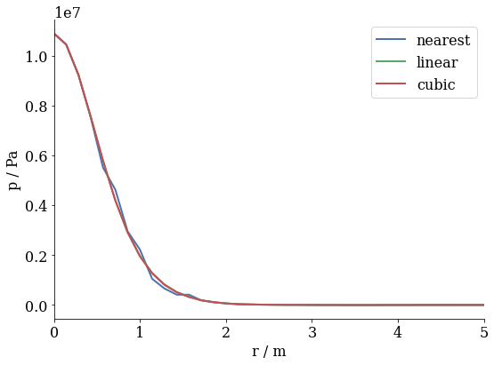
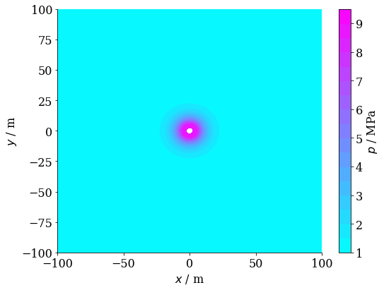

# Summary

ogs6py is a Python interface for the OpenGeoSys finite element software [@Bilke2019].
In conjunction with VTUinterface is is possible to streamline modeling workflows
in Jupyter Notebooks using Python.
With this article, we wish to introduce two new Python modules that facilitate
the pre- and postprocessing of finite element calculations of OpenGeoSys and thus
make this code more accessible. Their use is demonstrated along workflows typically
encountered by the modeller, including the variations of parameters, boundary conditions,
or solver settings, the verification of simulation results by comparison to analytical
solutions, the set-up and evaluation of ensemble runs, the analysis of results by line plots,
time series, or transient contour plots.

# Statement of need

Driven by its ease-of-use and flexibility as an open-source 
dynamic language, the vast Python ecosystem, the development of powerful plotting
libraries and the Jupyter Notebook technology, Python became the quasi-standard for 
scientific data analysis in the modelling community during the past decade.
However, the attractiveness of Phython is not just limited to postprocessing. 
E.g, with the Python wrapper for GMSH [@geuzaine2009gmsh] or the tool meshio [@] also pre-processing tasks can
be easily conducted without leaving the IPython command prompt. It is therefore a big advantage 
in usability nowadays for a modeling package if Python bindings are provided. In fact, 
while many open-source tools effectively forced the user to learn a singular syntax
for interacting with the software, Python bindings allow control over such tools from 
within the Python world and thus open them up for a wider community of users.

Here, we are particularly addressing the open-source code OpenGeoSys [@Bilke2019]. It is our aim,
to facilitate both pre- and post-processing workflows using the Python ecosystem. 
This aim was not the least inspired by the desire to facilitate setting up, controlling and
evaluating ensemble runs [@Buchwald2020,@Chaudhry2021] but has now taken on a wider perspective of general usability.

As standard output format, OpenGeoSys uses VTK unstructured grid files (VTU) as timeslices stacked together by a PVD file.
These can be analyzed typically using Paraview [@ahrens2005paraview]. For interactive Python use there exists the Python 
wrapper for VTK [@schroeder2000visualizing] and some other tools like PyVista [@sullivan2019pyvista] or Mayavi [@ramachandran2011mayavi] proding an easier access to the VTK library.
While the direct use of te vtk library is quite cumbersome for quite _simple_ tasks, like reading data for a given point or a set of points, especially when interpolation between grid points is also involved. The latter packages focus mainly on 3D visualization. However, the _bread and butter_ bussiness of a finite-element-modeler often cosists of the extraction of single- or multiple point time-series data.
To our knowledge the named packages (with the exception of Paraview) don't have file support for PVDs or time series data, yet ([@pvdissue; @timeseriesissue].

# Usage

With ogs6py it is possible to create complete OGS source files from scratch or to alter existing file. The folloing example uses a complete input file for a coupled THM point heat source problem exchanges a paremeter write the input and runs the problem.


```python
from ogs6py.ogs import OGS
```


```python
import plot_settings
```


```python
import vtuIO
```


```python
import numpy as np
```


```python
import matplotlib.pyplot as plt
```


```python
import matplotlib.pyplot as plt
import matplotlib.tri as tri
```

Reading in square_1e2_lin.prj and tell ogs6py to write the new project file to square_1e2_lin_out.prj


```python
model = OGS(INPUT_FILE="square_1e2_lin.prj", PROJECT_FILE="square_1e2_lin_out.prj", MKL=True)
```


```python
phi = 0.16
```

The following command replaces the porosity.


```python
model.replaceMediumProperty(mediumid=0, name="porosity", value=phi)
```

In an analogous way any other property or parameter can be changed.
ogs6py has also the capabilities to add XML code e.g., for additional properties.
The follow function writes the new file to disk


```python
model.writeInput()
```


    True


and execute ogs. The path to an ogs executable can be given as well as a logfile:


```python
model.runModel(path="~/github/ogs-build/build_mkl_master/bin", LOGFILE="out.log")
```

    OGS finished with project file square_1e2_lin_out.prj.
    Execution took 85.28426861763 s


The ouput can be eaysily analyzed using the the capabilities of the VTUinterface tool.
It is important to tell vtuIO the dimensionality of the problem in order to use the correct algorithm for interpolation.


```python
last_ts_vtu = vtuIO.VTUIO("square_1e0_lin_ts_100_t_500000.000000.vtu", dim=2)
```

Without interpolation any field corresponding to the order of node points (saved in .points variable) can be read with the following command.


```python
pressurefield = last_ts_vtu.getField("pressure_interpolated")
```

The available field names can be obtained as well using as single function call:


```python
last_ts_vtu.getFieldnames()
```


    ['HydraulicFlow',
     'NodalForces',
     'displacement',
     'epsilon',
     'pressure',
     'pressure_interpolated',
     'sigma',
     'temperature',
     'temperature_interpolated']


To make a contour plot matplotlibs triangulation tools can be used:


```python
triang = tri.Triangulation(last_ts_vtu.points[:,0],last_ts_vtu.points[:,1])
```


```python
plt.tricontourf(triang,pressurefield)
plt.xlabel("x")
plt.ylabel("y")
plt.colorbar()
plt.tight_layout()
```


Often it is important read out data at arbitraty points within the mesh or along predefined lines.
To do that we need to interpolate beween grid points.
VTUinterface uses scipy.interpolate for interpolation beween grid points, i.e. the user can select between different methods that are provided by scipy.interpolate.

A diagonal point set can be defined as follows:


```python
x = np.linspace(0,10,num=100)
```


```python
diagonal = [(i,i,0) for i in x]
```


```python
interp_methods = ["nearest", "linear", "cubic"]
```

Using three different interpolation methods, we can read a point set array along the diagonal.


```python
p_diagonal = {}
for method in interp_methods:
    p_diagonal[method] = last_ts_vtu.getPointSetData("pressure_interpolated", pointsetarray=diagonal, interpolation_method=method)
```


```python
r = np.sqrt(2*x*x)
```


```python
for method in interp_methods:
    plt.plot(r[:],p_diagonal[method], label=method)
    plt.xlim((0.0,5))
plt.legend()
plt.xlabel("r / m")
plt.ylabel("p / Pa")
plt.tight_layout()
```





One of the most significant features of VTUinterface is the ability to deal with PVD files as time series data.
A file can be read in using the PVDIO class similar for the VTUIO class.


```python
pvdfile = vtuIO.PVDIO(".","square_1e0_lin.pvd", dim=2)
```

    ./square_1e0_lin.pvd


Points are definen in the following format:


```python
points = {"pt0": (0.1,0.1,0.0), "pt1": (0.2,0.2,0), "pt2": (0.124,0.3,0.0)}
```

This data is enough to read in a time series of a given field:


```python
p_vs_t = pvdfile.readTimeSeries("pressure_interpolated", points)
```

The .timesteps variable holds the time axis as defined in the PVD file.


```python
for pt in points:
    plt.plot(pvdfile.timesteps, p_vs_t[pt], label=pt)
plt.legend()
plt.xlabel("t / s")
plt.ylabel("p / Pa")
plt.tight_layout()
```


The combination of ogs6py with VTUinterface allows to perform ensemble runs quite easily and to analyze the results directly on-the-fly.
E.g., considering a  distribution of a triangular distributed parameter like the porosity $\phi$:


```python
phi_dist = {"low": 0.12, "mid": 0.3, "high": 0.36} 
```


```python
phi = []
pressure =[]
for i in range(10):
    model = OGS(INPUT_FILE="square_1e2_lin.prj", PROJECT_FILE="square_1e2_lin_out.prj", MKL=True)
    phi.append(np.random.triangular(phi_dist["low"], phi_dist["mid"],phi_dist["high"]))
    model.replaceMediumProperty(mediumid=0, name="porosity", value=phi[-1])
    model.writeInput()
    model.runModel(path="~/github/ogs-build/build_mkl_master/bin", LOGFILE="out.log")
    last_ts_vtu = vtuIO.VTUIO("square_1e0_lin_ts_100_t_500000.000000.vtu", dim=2)
    p_data = last_ts_vtu.getPointData("pressure_interpolated", pts=points)
    pressure.append(p_data["pt0"])
```

    OGS finished with project file square_1e2_lin_out.prj.
    Execution took 88.08794116973877 s
    OGS finished with project file square_1e2_lin_out.prj.
    Execution took 86.88312768936157 s
    OGS finished with project file square_1e2_lin_out.prj.
    Execution took 84.42618703842163 s
    OGS finished with project file square_1e2_lin_out.prj.
    Execution took 90.0198221206665 s
    OGS finished with project file square_1e2_lin_out.prj.
    Execution took 82.55094814300537 s
    OGS finished with project file square_1e2_lin_out.prj.
    Execution took 87.03411412239075 s
    OGS finished with project file square_1e2_lin_out.prj.
    Execution took 86.81215977668762 s
    OGS finished with project file square_1e2_lin_out.prj.
    Execution took 83.7426118850708 s
    OGS finished with project file square_1e2_lin_out.prj.
    Execution took 86.03023838996887 s
    OGS finished with project file square_1e2_lin_out.prj.
    Execution took 83.28014135360718 s


Parallelization, e.g., by using Pythons concurrent future methods is straigtforward.


```python
plt.scatter(phi, pressure)
plt.xlabel('porosity')
plt.ylabel('pressure')
plt.tight_layout()
```


ogs6py als has a tool for parsing ogs output.
This can be very helpful for studying numerical stability and performance.
In the following example the output is read and the number or nonlinear iterations needed for every time step are ploted versus the time steps.


```python
out_df = model.parseOut("out.log")
```


```python
out_df.drop_duplicates(subset ="time_step/number", keep = "last", inplace = True)
```


```python
plt.plot(out_df["time_step/number"], out_df["time_step/iteration/number"])
plt.xlabel("time step")
plt.ylabel("iterations per time step")
plt.tight_layout()
```





# Acknowledgements

We acknowledge contributions from Tom Fischer, Dmitry Yu. Naumov and Dominik Kern
during the genesis of this project.

# References
