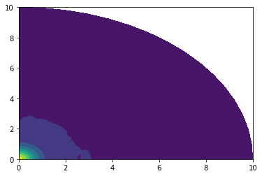
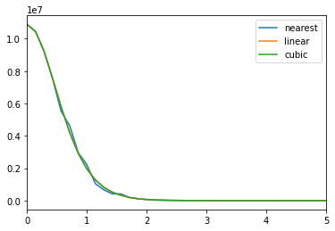
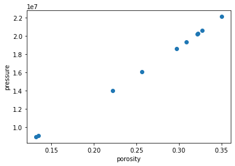
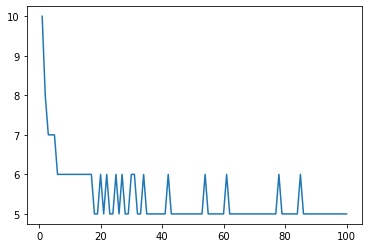

# Summary

ogs6py is a python interface for the OpenGeoSys finite element software.
In conjunction with VTUinterface is is possible to streamline modeling workflows
in jupyter notebooks using python.

# Statement of need

Within the last decade python became the quasi-standard for scientific data-analysis
in the modelling commounity. This because of its ease-of-use and flexibility as an open
source dynamic language, the gigantic Python ecosystem, the development of powerfull plotting
libraries and the jupyter notebook.
However, the attractiveness of Phython is not just limited to postprocessing. 
E.g, with the python wrapper for GMSH [@] or the tool meshio [@] also pre-processing tasks can
be easily conducted without leaving the IPython command prompt. It is therefore a big advantage 
in usability nowadays for a modeling package if python bindings are provided, not least the ability to
to facilitate ensemble runs.

As output OpenGeoSys produces VTU files as timeslices collected together by a PVD file.
These can be analyzed typically using Paraview [@]. For interactive Python use there exists the Python 
wrapper for VTK [@] and some other tools like PyVista or Mayavi proding an easier access to the VTK library.
While there focus is mainly 3D visualization, the _bread and butter_ bussiness of a finite-element-modeler often 
still requires the extraction of time-series data at arbitrarry point in the model domain.
To our knowledge the named packages don't support PVDs or time series data yet 
([issue1](https://github.com/pyvista/pyvista/issues/414)[issue2](https://github.com/pyvista/pyvista-support/issues/294)
[researchgate question](https://www.researchgate.net/post/How_to_plot_pvd_file_using_MayaVi)).

# Ussage


```python
from ogs6py.ogs import OGS
```


```python
import vtuIO
```


```python
import numpy as np
```


```python
import matplotlib.pyplot as plt
```


```python
import matplotlib.pyplot as plt
import matplotlib.tri as tri
```


```python
model = OGS(INPUT_FILE="square_1e2_lin.prj", PROJECT_FILE="square_1e2_lin_out.prj", MKL=True)
```


```python
phi = 0.16
```


```python
model.replaceMediumProperty(mediumid=0, name="porosity", value=phi)
```


```python
model.writeInput()
```


    True


```python
model.runModel(path="~/github/ogs-build/build_mkl_master/bin", LOGFILE="out.log")
```

    OGS finished with project file square_1e2_lin_out.prj.
    Execution took 78.41022038459778 s


```python
last_ts_vtu = vtuIO.VTUIO("square_1e0_lin_ts_100_t_500000.000000.vtu", dim=2)
```


```python
pressurefield = last_ts_vtu.getField("pressure_interpolated")
```


```python
triang = tri.Triangulation(last_ts_vtu.points[:,0],last_ts_vtu.points[:,1])
```


```python
plt.tricontourf(triang,pressurefield)
```


    <matplotlib.tri.tricontour.TriContourSet at 0x7f42ea517df0>





```python
x = np.linspace(0,10,num=100)
```


```python
diagonal = [(i,i,0) for i in x]
```


```python
interp_methods = ["nearest", "linear", "cubic"]
```


```python
p_diagonal = {}
for method in interp_methods:
    p_diagonal[method] = last_ts_vtu.getPointSetData("pressure_interpolated", pointsetarray=diagonal, interpolation_method=method)
```


```python
r = np.sqrt(2*x*x)
```


```python
for method in interp_methods:
    plt.plot(r[:],p_diagonal[method], label=method)
    plt.xlim((0.0,5))
plt.legend()    
```


    <matplotlib.legend.Legend at 0x7f42ea4e2fd0>





```python
pvdfile = vtuIO.PVDIO(".","square_1e0_lin.pvd", dim=2)
```

    ./square_1e0_lin.pvd


```python
points = {"pt0": (0.1,0.1,0.0), "pt1": (0.2,0.2,0), "pt2": (0.124,0.3,0.0)}
```


```python
p_vs_t = pvdfile.readTimeSeries("pressure_interpolated", points)
```


```python
for pt in points:
    plt.plot(pvdfile.timesteps, p_vs_t[pt])
```


```python
phi_dist = {"low": 0.12, "mid": 0.3, "high": 0.36} 
```


```python
phi = []
pressure =[]
for i in range(10):
    model = OGS(INPUT_FILE="square_1e2_lin.prj", PROJECT_FILE="square_1e2_lin_out.prj", MKL=True)
    phi.append(np.random.triangular(phi_dist["low"], phi_dist["mid"],phi_dist["high"]))
    model.replaceMediumProperty(mediumid=0, name="porosity", value=phi[-1])
    model.writeInput()
    model.runModel(path="~/github/ogs-build/build_mkl_master/bin", LOGFILE="out.log")
    last_ts_vtu = vtuIO.VTUIO("square_1e0_lin_ts_100_t_500000.000000.vtu", dim=2)
    p_data = last_ts_vtu.getPointData("pressure_interpolated", pts=points)
    pressure.append(p_data["pt0"])
```

    OGS finished with project file square_1e2_lin_out.prj.
    Execution took 81.16767597198486 s
    OGS finished with project file square_1e2_lin_out.prj.
    Execution took 84.81383776664734 s
    OGS finished with project file square_1e2_lin_out.prj.
    Execution took 83.69526481628418 s
    OGS finished with project file square_1e2_lin_out.prj.
    Execution took 85.80170345306396 s
    OGS finished with project file square_1e2_lin_out.prj.
    Execution took 85.60525226593018 s
    OGS finished with project file square_1e2_lin_out.prj.
    Execution took 86.17963027954102 s
    OGS finished with project file square_1e2_lin_out.prj.
    Execution took 82.96798539161682 s
    OGS finished with project file square_1e2_lin_out.prj.
    Execution took 84.3891429901123 s
    OGS finished with project file square_1e2_lin_out.prj.
    Execution took 86.55081033706665 s
    OGS finished with project file square_1e2_lin_out.prj.
    Execution took 87.14056372642517 s


```python
plt.scatter(phi, pressure)
plt.xlabel('porosity')
plt.ylabel('pressure')
```


    Text(0, 0.5, 'pressure')





```python
out_df = model.parseOut("out.log")
```


```python
out_df.drop_duplicates(subset ="time_step/number", keep = "last", inplace = True)
```


```python
plt.plot(out_df["time_step/number"], out_df["time_step/iteration/number"])
```


    [<matplotlib.lines.Line2D at 0x7f42e925d460>]





# Citations

Citations to entries in paper.bib should be in
[rMarkdown](http://rmarkdown.rstudio.com/authoring_bibliographies_and_citations.html)
format.

If you want to cite a software repository URL (e.g. something on GitHub without a preferred
citation) then you can do it with the example BibTeX entry below for .

For a quick reference, the following citation commands can be used:
- `@author:2001`  ->  "Author et al. (2001)"
- `[@author:2001]` -> "(Author et al., 2001)"
- `[@author1:2001; @author2:2001]` -> "(Author1 et al., 2001; Author2 et al., 2002)"


# Acknowledgements

We acknowledge contributions from Brigitta Sipocz, Syrtis Major, and Semyeong
Oh, and support from Kathryn Johnston during the genesis of this project.

# References


```python

```
